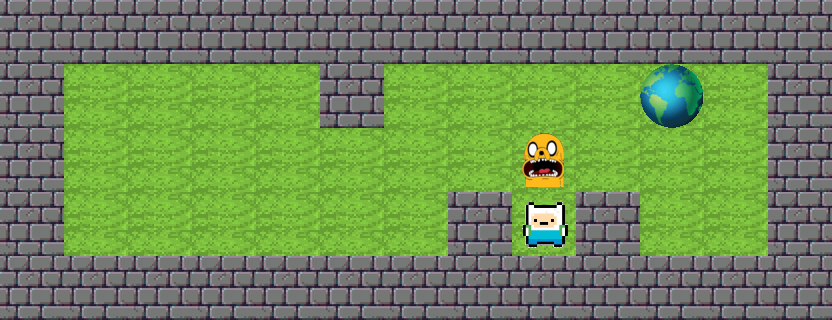

# SO_LONG

`SO_LONG` is a small 2D tile-based game from the 42 curriculum. The player moves through a `.ber` map, collects every collectible, and exits the level while the move counter is printed to stdout.

## Preview

This image was generated directly from the repository's own textures and sample map file:



## Gameplay rules implemented in this repository

From the current source:

- the map border must be fully closed by walls (`1`)
- allowed map characters are `1`, `0`, `P`, `E`, and `C`
- there must be exactly one player (`P`)
- there must be exactly one exit (`E`)
- there must be at least one collectible (`C`)
- map size is capped at `< 41` columns and `< 22` rows
- a flood-fill validation checks that all `P`, `E`, and `C` tiles are reachable

Relevant files:

- [`so_long/control.c`](so_long/control.c): map parsing and validation
- [`so_long/flood_fill.c`](so_long/flood_fill.c): reachability check
- [`so_long/key.c`](so_long/key.c): movement and win condition
- [`so_long/exalidraw.c`](so_long/exalidraw.c): tile rendering

## Controls

The current key mapping is the classic 42 MiniLibX macOS mapping:

- `W`: move up
- `A`: move left
- `S`: move down
- `D`: move right
- `ESC`: close the game

## Build

From inside the game directory:

```bash
cd so_long
make
```

This is intended to produce:

```text
./so_long
```

## Run

```bash
./so_long maps/map.ber
```

Alternative sample maps are available in [`so_long/maps`](so_long/maps).

## Dependency note

This repository expects a local MiniLibX checkout under:

```text
so_long/mlx
```

and links with:

```text
-lmlx -framework OpenGL -framework AppKit
```

During this documentation pass, the project could not be fully launched on this machine because the required MiniLibX/X11 dependency chain was not already available in the repository or system environment. That is why the preview above is an asset-based render from the included textures and map file rather than a runtime screenshot from an active window.

## Project structure

```text
SO_LONG/
└── so_long/
    ├── maps/                 # sample .ber maps
    ├── textures/             # XPM textures
    ├── control.c             # map loading + validation
    ├── flood_fill.c          # reachability validation
    ├── key.c                 # movement handling
    ├── exalidraw.c           # image loading + drawing
    ├── error.c               # shutdown / error paths
    ├── ft_printf/            # bundled printf dependency
    ├── get_next_line/        # bundled line reader dependency
    └── Makefile
```

## Sample map format

The included [`so_long/maps/map.ber`](so_long/maps/map.ber) looks like this:

```text
1111111111111
1000010000E01
10000000C0001
10000001P1001
1111111111111
```
